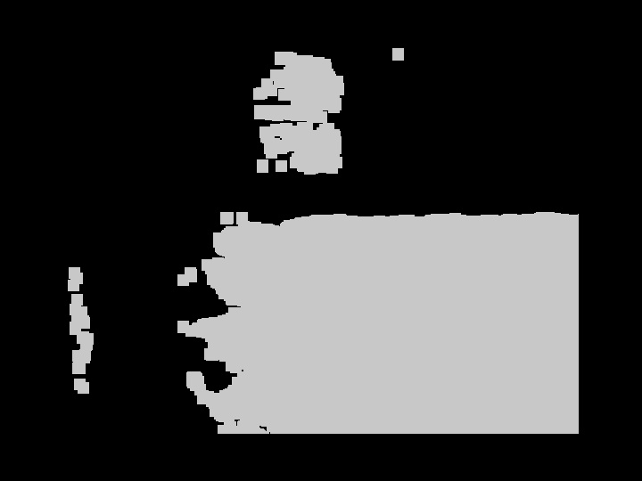
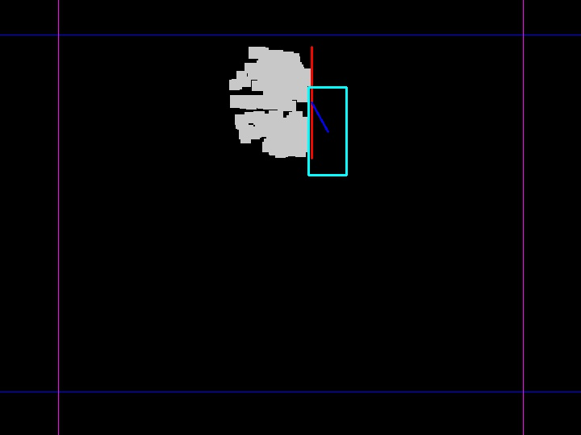

# Requisite
my encironment
Opencv 3.4.0
realsense SDK 2.55.1   d455

# Run
mkdir build
cd build
cmake ..
make 
# PIN detection
C++ implementation of Pin detection algorithms.

Currently available algorithms:

 - Enhance lightness (light average value > 14 (set by yourself) )
 - setting ROI (xy direction)
 - Image Binarization & threshold
 - filter area large block
 - Image erode & dilate

The project includes GUI for viewing results.

## Examples

### Original image

### Binarization pin detection

### Output pin detection

